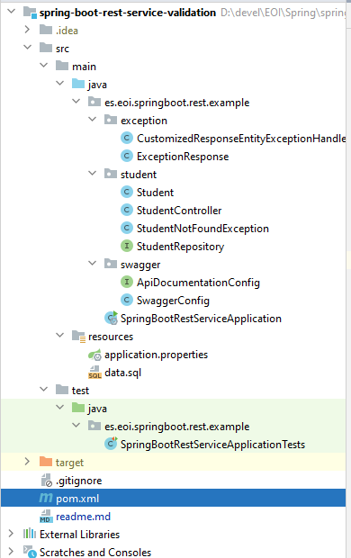
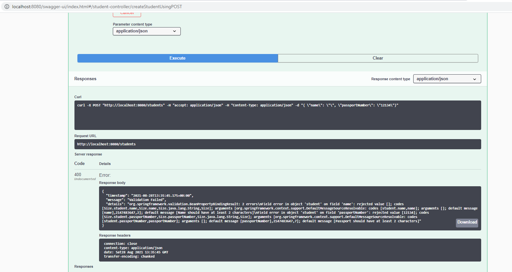

# Implementing Validation for RESTful Services with Spring Boot

This guide will help you implement effective validations for a REST API/Service with Spring Boot

You will learn
- What is validation?
- Why do you need validation?
- What is Hibernate Validator?
- What is Bean Validation API?
- What are the default validation capabilities provided by Spring Boot?
- How to implement validation with Spring Boot?
- How to implement validation with Bean Validation API?

## What is Validation?

You expect a certain format of request for your RESTful Service. You except the elements of your request to have certain data types, certain domain constraints.

What if you get a request not meeting this constraints?

Think. What should you do?

Can I just return a generic message Something went wrong.. Is that good enough?

One of the core design principles for RESTful services is

```
Think about the consumer
```

So, what should you do when something in the request is not valid.

You should return a proper error response

- Clear message indicating what went wrong? Which field has an error and what are the accepted values? What the consumer can do to fix the error?
- Proper Response Status Bad Request.
- Do not include sensitive information in the response.

## Response Statuses for Validation Errors

Recommended response status for validation error is -> 400 - BAD REQUEST

## Default Validation with Spring Boot

Spring Boot provides good default implementation for validation for RESTful Services. Let’s quickly look at the default Exception Handling features provided by Spring Boot.

### Wrong Content Type
If you use Content-Type as application/xml and this is not supported by your application, Spring Boot by default returns a response status of 415 - Unsupported Media Type

### Invalid JSON Content
If you send a invalid JSON content to a method expecting a body, you would get a 400 - Bad Request

### Valid JSON with Missing Elements
However, if you send a valid JSON structure with missing/invalid attributes/elements, application will execute the request with what ever data is available.

Following request executes with a status of -> 201 Created

    POST http://localhost:8080/students

Empty Request Content
```
{

}
```
Following request executes with a status of -> 201 Created

    POST http://localhost:8080/students

Request Content

```
{
    "name1": null,
    "passportNumber": "A12345678"
}
```

You can notice that the above request has an invalid attribute name1.

This is the response when you fire a GET to `http://localhost:8080/students`
```
[ { “id”: 1, “name”: null, “passportNumber”: null }, { “id”: 2, “name”: null, “passportNumber”: “A12345678” }, { “id”: 10001, “name”: “Ranga”, “passportNumber”: “E1234567” }, { “id”: 10002, “name”: “Ravi”, “passportNumber”: “A1234568” } ]
```
You can see that both the resources were created with ids 1 and 2 with nulls for values that were not available. Invalid elements/attributes are ignored.

## Customizing Validations

To customize the validation, we will use Hibernate Validator, which is one of the implementations of the bean validation api.

We get Hibernate Validator for free when we use Spring Boot Starter Web.

So, we can get started with implementing the validations.

## Project Code Structure
Following files contain the important components of the project we will create. A few details:

- SpringBootRestServiceApplication.java - The Spring Boot Application class generated with Spring Initializer. This class acts as the launching point for application.
- pom.xml - Contains all the dependencies needed to build this project. We will use Spring Boot Starter AOP.
- Student.java - Student JPA Entity
- StudentRepository.java - Student JPA Repository. This is created using Spring Data JpaRepository.
- StudentResource.java - Spring Rest Controller exposing all services on the student resource.
- CustomizedResponseEntityExceptionHandler.java - Component to implement global exception handling and customize the response based on the exception type.
- ErrorDetails.java - Response Bean to use when exceptions are thrown from API.
- StudentNotFoundException.java - Exception thrown from resources when student is not found.
- data.sql - Initial data for the student table. Spring Boot would execute this script after the tables are created from the entities.




## Implementing Validations on the Bean

Before we add validations, we need to add a dependency.
```xml
<dependency>
      <groupId>org.springframework.boot</groupId>
      <artifactId>spring-boot-starter-validation</artifactId>
</dependency>
```

Let’s add a few validations to the Student bean. We are using @Size to specify the minimum length and also a message when a validation error occurs.
```java
@Entity
public class Student {
  @Id
  @GeneratedValue
  private Long id;
  
  @NotNull
  @Size(min=2, message="Name should have atleast 2 characters")
  private String name;
  
  @NotNull
  @Size(min=7, message="Passport should have atleast 7 characters")
  private String passportNumber;
```

Bean Validation API provides a number of such annotations. Most of these are self explanatory.

- DecimalMax
- DecimalMin
- Digits
- Email
- Future
- FutureOrPresent
- Max
- Min
- Negative
- NegativeOrZero
- NotBlank
- NotEmpty
- NotNull
- Null
- Past
- PastOrPresent
- Pattern
- Positive
- PositiveOrZero

## Enabling Validation on the Resource

Simple. Add @Valid in addition to @RequestBody.
```java
public ResponseEntity<Object> createStudent(@Valid @RequestBody Student student) {
```

That’s it.

When you execute a request with attributes not matching the constraint, you get a 404 BAD Request status back.

Request
```json
{
    "name": "",
    "passportNumber": "A12345678"
}
```

But the problem is that there are no details returned indicating what went wrong.

- The consumer knows its a bad request.
- But, how do they no what is wrong? Which element did not pass the validation? What should the consumer do to fix it?



## Customizing Validation Response

Let’s define a simple error response bean.
```java
public class ErrorDetails {
  private Date timestamp;
  private String message;
  private String details;

  public ErrorDetails(Date timestamp, String message, String details) {
    super();
    this.timestamp = timestamp;
    this.message = message;
    this.details = details;
  }
```

Let’s now define a @ControllerAdvice to handle validation errors. We do that by overriding handleMethodArgumentNotValid(MethodArgumentNotValidException ex, HttpHeaders headers, HttpStatus status, WebRequest request) method in the ResponseEntityExceptionHandler.

```java
@ControllerAdvice
@RestController
public class CustomizedResponseEntityExceptionHandler extends ResponseEntityExceptionHandler {

  @Override
  protected ResponseEntity<Object> handleMethodArgumentNotValid(MethodArgumentNotValidException ex,
      HttpHeaders headers, HttpStatus status, WebRequest request) {
    ErrorDetails errorDetails = new ErrorDetails(new Date(), "Validation Failed",
        ex.getBindingResult().toString());
    return new ResponseEntity(errorDetails, HttpStatus.BAD_REQUEST);
  } 
```

To use ErrorDetails to return the error response, let’s define a ControllerAdvice as shown below.
```java
@ControllerAdvice
@RestController
public class CustomizedResponseEntityExceptionHandler extends ResponseEntityExceptionHandler {

@ExceptionHandler(StudentNotFoundException)
public final ResponseEntity<ErrorDetails> handleUserNotFoundException(StudentNotFoundException ex, WebRequest request) {
    ErrorDetails errorDetails = new ErrorDetails(new Date(), ex.getMessage(),
    request.getDescription(false));
    return new ResponseEntity<>(errorDetails, HttpStatus.NOT_FOUND);
}
```

When you execute a request with attributes not matching the constraint, you get a 404 BAD Request status back.

Request
```json
{
    "name": "",
    "passportNumber": "A12345678"
}
```

You also get a Response Body indicating what is wrong!
```json
{
  "timestamp": 1512717715118,
  "message": "Validation Failed",
  "details": "org.springframework.validation.BeanPropertyBindingResult: 1 errors\nField error in object 'student' on field 'name': rejected value []; codes [Size.student.name,Size.name,Size.java.lang.String,Size]; arguments [org.springframework.context.support.DefaultMessageSourceResolvable: codes [student.name,name]; arguments []; default message [name],2147483647,2]; default message [Name should have atleast 2 characters]"
}
```

Good Luck! You are all set now to customize the message based on your needs.


## Complete Code Example


### /pom.xml

```xml
<?xml version="1.0" encoding="UTF-8"?>
<project xmlns="http://maven.apache.org/POM/4.0.0"
         xmlns:xsi="http://www.w3.org/2001/XMLSchema-instance"
         xsi:schemaLocation="http://maven.apache.org/POM/4.0.0 http://maven.apache.org/xsd/maven-4.0.0.xsd">
    <modelVersion>4.0.0</modelVersion>

    <groupId>es.eoi.springboot.rest.example</groupId>
    <artifactId>spring-boot-rest-service-validation</artifactId>
    <version>0.0.1-SNAPSHOT</version>
    <packaging>jar</packaging>

    <name>spring-boot-rest-service</name>
    <description>Spring Boot and REST - Example Project</description>

    <parent>
        <groupId>org.springframework.boot</groupId>
        <artifactId>spring-boot-starter-parent</artifactId>
        <version>2.3.1.RELEASE</version>
        <relativePath />
    </parent>

    <properties>
        <project.build.sourceEncoding>UTF-8</project.build.sourceEncoding>
        <project.reporting.outputEncoding>UTF-8</project.reporting.outputEncoding>
        <java.version>1.8</java.version>
        <maven-jar-plugin.version>3.1.1</maven-jar-plugin.version>
    </properties>

    <dependencies>
        <dependency>
            <groupId>org.springframework.boot</groupId>
            <artifactId>spring-boot-starter-actuator</artifactId>
        </dependency>
        <dependency>
            <groupId>org.springframework.boot</groupId>
            <artifactId>spring-boot-starter-data-jpa</artifactId>
        </dependency>
        <dependency>
            <groupId>org.springframework.boot</groupId>
            <artifactId>spring-boot-starter-web</artifactId>
        </dependency>
        <dependency>
            <groupId>org.springframework.boot</groupId>
            <artifactId>spring-boot-starter-hateoas</artifactId>
        </dependency>
        <dependency>
            <groupId>org.springframework.boot</groupId>
            <artifactId>spring-boot-starter-validation</artifactId>
        </dependency>
        <dependency>
            <groupId>org.springframework.boot</groupId>
            <artifactId>spring-boot-devtools</artifactId>
            <scope>runtime</scope>
        </dependency>
        <dependency>
            <groupId>io.springfox</groupId>
            <artifactId>springfox-boot-starter</artifactId>
            <version>3.0.0</version>
        </dependency>
        <dependency>
            <groupId>com.h2database</groupId>
            <artifactId>h2</artifactId>
            <scope>runtime</scope>
        </dependency>
        <dependency>
            <groupId>org.springframework.boot</groupId>
            <artifactId>spring-boot-starter-test</artifactId>
            <scope>test</scope>
        </dependency>
    </dependencies>

    <build>
        <plugins>
            <plugin>
                <groupId>org.springframework.boot</groupId>
                <artifactId>spring-boot-maven-plugin</artifactId>
            </plugin>
        </plugins>
    </build>

    <repositories>
        <repository>
            <id>spring-snapshots</id>
            <name>Spring Snapshots</name>
            <url>https://repo.spring.io/snapshot</url>
            <snapshots>
                <enabled>true</enabled>
            </snapshots>
        </repository>
        <repository>
            <id>spring-milestones</id>
            <name>Spring Milestones</name>
            <url>https://repo.spring.io/milestone</url>
            <snapshots>
                <enabled>false</enabled>
            </snapshots>
        </repository>
    </repositories>

    <pluginRepositories>
        <pluginRepository>
            <id>spring-snapshots</id>
            <name>Spring Snapshots</name>
            <url>https://repo.spring.io/snapshot</url>
            <snapshots>
                <enabled>true</enabled>
            </snapshots>
        </pluginRepository>
        <pluginRepository>
            <id>spring-milestones</id>
            <name>Spring Milestones</name>
            <url>https://repo.spring.io/milestone</url>
            <snapshots>
                <enabled>false</enabled>
            </snapshots>
        </pluginRepository>
    </pluginRepositories>
</project>


```
---

### /src/main/java/es/eoi/springboot/rest/example/exception/CustomizedResponseEntityExceptionHandler.java

```java
package es.eoi.springboot.rest.example.exception;

import java.util.Date;

import es.eoi.springboot.rest.example.exception.ExceptionResponse;
import org.springframework.http.HttpHeaders;
import org.springframework.http.HttpStatus;
import org.springframework.http.ResponseEntity;
import org.springframework.web.bind.MethodArgumentNotValidException;
import org.springframework.web.bind.annotation.ControllerAdvice;
import org.springframework.web.bind.annotation.ExceptionHandler;
import org.springframework.web.bind.annotation.RestController;
import org.springframework.web.context.request.WebRequest;
import org.springframework.web.servlet.mvc.method.annotation.ResponseEntityExceptionHandler;

import es.eoi.springboot.rest.example.student.StudentNotFoundException;

@ControllerAdvice
@RestController
public class CustomizedResponseEntityExceptionHandler extends ResponseEntityExceptionHandler {

    @ExceptionHandler(Exception.class)
    public final ResponseEntity<Object> handleAllExceptions(Exception ex, WebRequest request) {
        ExceptionResponse exceptionResponse = new ExceptionResponse(new Date(), ex.getMessage(),
                request.getDescription(false));
        return new ResponseEntity(exceptionResponse, HttpStatus.INTERNAL_SERVER_ERROR);
    }

    @ExceptionHandler(StudentNotFoundException.class)
    public final ResponseEntity<Object> handleUserNotFoundException(StudentNotFoundException ex, WebRequest request) {
        ExceptionResponse exceptionResponse = new ExceptionResponse(new Date(), ex.getMessage(),
                request.getDescription(false));
        return new ResponseEntity(exceptionResponse, HttpStatus.NOT_FOUND);
    }

    @Override
    protected ResponseEntity<Object> handleMethodArgumentNotValid(MethodArgumentNotValidException ex,
                                                                  HttpHeaders headers, HttpStatus status, WebRequest request) {
        ExceptionResponse exceptionResponse = new ExceptionResponse(new Date(), "Validation Failed",
                ex.getBindingResult().toString());
        return new ResponseEntity(exceptionResponse, HttpStatus.BAD_REQUEST);
    }
}
```
---

### /src/main/java/es/eoi/springboot/rest/example/exception/ExceptionResponse.java

```java
package es.eoi.springboot.rest.example.exception;
import java.util.Date;

public class ExceptionResponse {
  private Date timestamp;
  private String message;
  private String details;

  public ExceptionResponse(Date timestamp, String message, String details) {
    super();
    this.timestamp = timestamp;
    this.message = message;
    this.details = details;
  }

  public Date getTimestamp() {
    return timestamp;
  }

  public String getMessage() {
    return message;
  }

  public String getDetails() {
    return details;
  }

}
```
---

### /src/main/java/es/eoi/springboot/rest/example/SpringBoot2RestServiceApplication.java

```java
package es.eoi.springboot.rest.example;

import org.springframework.boot.SpringApplication;
import org.springframework.boot.autoconfigure.SpringBootApplication;

@SpringBootApplication
public class SpringBootRestServiceApplication {

	public static void main(String[] args) {
		SpringApplication.run(SpringBootRestServiceApplication.class, args);
	}
}
```
---

### /src/main/java/es/eoi/springboot/rest/example/student/Student.java

```java
package es.eoi.springboot.rest.example.student;

import javax.persistence.Entity;
import javax.persistence.GeneratedValue;
import javax.persistence.Id;
import javax.validation.constraints.Size;

@Entity
public class Student {
	@Id
	@GeneratedValue
	private Long id;
	
	@Size(min=2, message="Name should have at least 2 characters")
	private String name;
	
	private String passportNumber;
	
	public Student() {
		super();
	}

	public Student(Long id, String name, String passportNumber) {
		super();
		this.id = id;
		this.name = name;
		this.passportNumber = passportNumber;
	}
	public Long getId() {
		return id;
	}
	public void setId(Long id) {
		this.id = id;
	}
	public String getName() {
		return name;
	}
	public void setName(String name) {
		this.name = name;
	}
	public String getPassportNumber() {
		return passportNumber;
	}
	public void setPassportNumber(String passportNumber) {
		this.passportNumber = passportNumber;
	}
		
}
```
---

### /src/main/java/es/eoi/springboot/rest/example/student/StudentNotFoundException.java

```java
package es.eoi.springboot.rest.example.student;

import org.springframework.http.HttpStatus;
import org.springframework.web.bind.annotation.ResponseStatus;

@ResponseStatus(HttpStatus.NOT_FOUND)
public class StudentNotFoundException extends RuntimeException {

	public StudentNotFoundException(String exception) {
		super(exception);
	}

}
```
---

### /src/main/java/es/eoi/springboot/rest/example/student/StudentRepository.java

```java
package es.eoi.springboot.rest.example.student;

import es.eoi.springboot.rest.example.student.Student;
import org.springframework.data.jpa.repository.JpaRepository;
import org.springframework.stereotype.Repository;

@Repository
public interface StudentRepository extends JpaRepository<Student, Long> {

}
```
---

### /src/main/java/es/eoi/springboot/rest/example/student/StudentController.java

```java
package es.eoi.springboot.rest.example.student;

import static org.springframework.hateoas.mvc.ControllerLinkBuilder.linkTo;
import static org.springframework.hateoas.mvc.ControllerLinkBuilder.methodOn;

import java.net.URI;
import java.util.List;
import java.util.Optional;

import javax.validation.Valid;

import es.eoi.springboot.rest.example.student.Student;
import es.eoi.springboot.rest.example.student.StudentNotFoundException;
import es.eoi.springboot.rest.example.student.StudentRepository;
import org.springframework.beans.factory.annotation.Autowired;
import org.springframework.hateoas.Resource;
import org.springframework.hateoas.mvc.ControllerLinkBuilder;
import org.springframework.http.ResponseEntity;
import org.springframework.web.bind.annotation.DeleteMapping;
import org.springframework.web.bind.annotation.GetMapping;
import org.springframework.web.bind.annotation.PathVariable;
import org.springframework.web.bind.annotation.PostMapping;
import org.springframework.web.bind.annotation.PutMapping;
import org.springframework.web.bind.annotation.RequestBody;
import org.springframework.web.bind.annotation.RestController;
import org.springframework.web.servlet.support.ServletUriComponentsBuilder;

@RestController
public class StudentController {

    @Autowired
    private StudentRepository studentRepository;

    @GetMapping("/students")
    public List<Student> retrieveAllStudents() {
        return studentRepository.findAll();
    }

    @GetMapping("/students/{id}")
    public Resource<Student> retrieveStudent(@PathVariable long id) {
        Optional<Student> student = studentRepository.findById(id);

        if (!student.isPresent())
            throw new StudentNotFoundException("id-" + id);

        Resource<Student> resource = new Resource<Student>(student.get());

        ControllerLinkBuilder linkTo = linkTo(methodOn(this.getClass()).retrieveAllStudents());

        resource.add(linkTo.withRel("all-students"));

        return resource;
    }

    @DeleteMapping("/students/{id}")
    public void deleteStudent(@PathVariable long id) {
        studentRepository.deleteById(id);
    }

    @PostMapping("/students")
    public ResponseEntity<Object> createStudent(@Valid @RequestBody Student student) {
        Student savedStudent = studentRepository.save(student);

        URI location = ServletUriComponentsBuilder.fromCurrentRequest().path("/{id}")
                .buildAndExpand(savedStudent.getId()).toUri();

        return ResponseEntity.created(location).build();

    }

    @PutMapping("/students/{id}")
    public ResponseEntity<Object> updateStudent(@Valid @RequestBody Student student, @PathVariable long id) {

        Optional<Student> studentOptional = studentRepository.findById(id);

        if (!studentOptional.isPresent())
            return ResponseEntity.notFound().build();

        student.setId(id);

        studentRepository.save(student);

        return ResponseEntity.noContent().build();
    }
}
```
---

### /src/main/resources/application.properties

```properties
# Enabling H2 Console
spring.h2.console.enabled=true

spring.datasource.url=jdbc:h2:mem:testdb
```
---

### /src/main/resources/data.sql

```
insert into student values(10001,'Jose Francisco', 'E1234567');

insert into student values(10002,'Maria Angeles', 'A1234568');
```
---

### /src/test/java/es/eoi/springboot/rest/example/SpringBoot2RestServiceApplicationTests.java

```java
package es.eoi.springboot.rest.example;

import org.junit.Test;
import org.junit.runner.RunWith;
import org.springframework.boot.test.context.SpringBootTest;
import org.springframework.test.context.junit4.SpringRunner;

@RunWith(SpringRunner.class)
@SpringBootTest
public class SpringBoot2RestServiceApplicationTests {

	@Test
	public void contextLoads() {
	}

}
```
---
