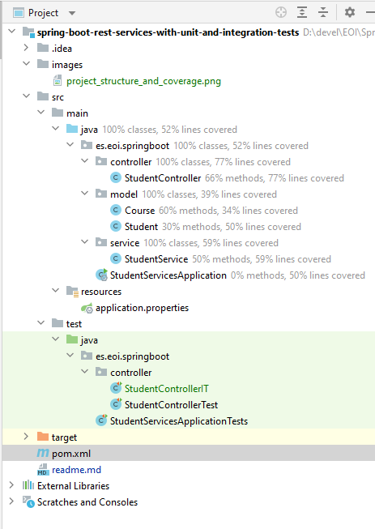

# Writing Integration and Web Mvc Tests for Rest Services with Spring Boot

This guide will help you write great integration tests for your Spring Boot Rest Service. We will use a simple code example creating couple of simple rest services.

You will learn
- What is Integration Testing?
- How to create a Get REST Service for retrieving the courses that a student registered for?
- How to write a integration test for Get REST Service?
- How to create a Post REST Service for registering a course for student?
- How to write a integration test for the POST Service?

## Integration Testing

Following screenshot shows our IDE project with all the files we will create


We want to create a integration test for StudentController which is a Rest Controller. StudentController exposes two service methods - one Get and one Post. We will write integration tests for both these service methods.

In the integration test

- We will launch the complete Spring Boot application using @SpringBootTest
- We will invoke the service methods using TestRestTemplate
- We will assert the results using a great JSON assert framework - org.skyscreamer.jsonassert.JSONAssert
A key part of integration testing is testing all the layers in the application

## Implementing Business Service for your Application


All applications need data. Instead of talking to a real database, we will use an ArrayList - kind of an in-memory data store.

A student can take multiple courses. A course has an id, name, description and a list of steps you need to complete to finish the course. A student has an id, name, description and a list of courses he/she is currently registered for. We have StudentService exposing methods to

- public List<Student> retrieveAllStudents() - Retrieve details for all students
- public Student retrieveStudent(String studentId) - Retrieve a specific student details
- public List<Course> retrieveCourses(String studentId) - Retrieve all courses a student is registered for
- public Course retrieveCourse(String studentId, String courseId) - Retrieve details of a specific course a student is registered for
- public Course addCourse(String studentId, Course course) - Add a course to an existing student

Refer to these files at the bottom of the article for exact implementation of the Service StudentService and the model classes Course and Student

- Course.java
- Student.java
- StudentService.java

## Adding Couple of GET Rest Services

The Rest Service StudentController exposes couple of get services.

- @Autowired private StudentService studentService : We are using Spring Autowiring to wire the student service into the StudentController.
- @GetMapping("/students/{studentId}/courses"): Exposing a Get Service with studentId as a path variable
- @GetMapping("/students/{studentId}/courses/{courseId}"): Exposing a Get Service for retrieving specific course of a student.
- @PathVariable String studentId: Value of studentId from the uri will be mapped to this parameter.

```java
  @Autowired
  private StudentService studentService;

  @GetMapping("/students/{studentId}/courses")
  public List<Course> retrieveCoursesForStudent(@PathVariable String studentId) {
    return studentService.retrieveCourses(studentId);
  }

  @GetMapping("/students/{studentId}/courses/{courseId}")
  public Course retrieveDetailsForCourse(@PathVariable String studentId,
  @PathVariable String courseId) {
    return studentService.retrieveCourse(studentId, courseId);
  }
}
```

## MVC tests

```java
package es.eoi.springboot.controller;

import static org.junit.Assert.assertEquals;

import java.util.Arrays;

import es.eoi.springboot.model.Course;
import org.junit.Test;
import org.junit.runner.RunWith;
import org.mockito.Mockito;
import org.skyscreamer.jsonassert.JSONAssert;
import org.springframework.beans.factory.annotation.Autowired;
import org.springframework.boot.test.autoconfigure.web.servlet.WebMvcTest;
import org.springframework.boot.test.mock.mockito.MockBean;
import org.springframework.http.HttpHeaders;
import org.springframework.http.HttpStatus;
import org.springframework.http.MediaType;
import org.springframework.mock.web.MockHttpServletResponse;
import org.springframework.security.test.context.support.WithMockUser;
import org.springframework.test.context.junit4.SpringRunner;
import org.springframework.test.web.servlet.MockMvc;
import org.springframework.test.web.servlet.MvcResult;
import org.springframework.test.web.servlet.RequestBuilder;
import org.springframework.test.web.servlet.request.MockMvcRequestBuilders;

import es.eoi.springboot.service.StudentService;

@RunWith(SpringRunner.class)
@WebMvcTest(value = StudentController.class)
@WithMockUser
public class StudentControllerTest {

	@Autowired
	private MockMvc mockMvc;

	@MockBean
	private StudentService studentService;

	Course mockCourse = new Course("Course1", "Spring", "10Steps",
			Arrays.asList("Learn Maven", "Import Project", "First Example", "Second Example"));

	String exampleCourseJson = "{\"name\":\"Spring\",\"description\":\"10Steps\",\"steps\":[\"Learn Maven\",\"Import Project\",\"First Example\",\"Second Example\"]}";

	@Test
	public void retrieveDetailsForCourse() throws Exception {

		Mockito.when(studentService.retrieveCourse(Mockito.anyString(), Mockito.anyString())).thenReturn(mockCourse);

		RequestBuilder requestBuilder = MockMvcRequestBuilders.get(
				"/students/Student1/courses/Course1").accept(
				MediaType.APPLICATION_JSON);

		MvcResult result = mockMvc.perform(requestBuilder).andReturn();

		System.out.println(result.getResponse());
		String expected = "{id:Course1,name:Spring,description:10Steps}";

		// {"id":"Course1","name":"Spring","description":"10 Steps, 25 Examples and 10K Students","steps":["Learn Maven","Import Project","First Example","Second Example"]}

		JSONAssert.assertEquals(expected, result.getResponse().getContentAsString(), false);
	}

	@Test
	public void createStudentCourse() throws Exception {
		Course mockCourse = new Course("1", "Smallest Number", "1",
				Arrays.asList("1", "2", "3", "4"));

		// studentService.addCourse to respond back with mockCourse
		Mockito.when(
				studentService.addCourse(Mockito.anyString(),
						Mockito.any(Course.class))).thenReturn(mockCourse);

		// Send course as body to /students/Student1/courses
		RequestBuilder requestBuilder = MockMvcRequestBuilders
				.post("/students/Student1/courses")
				.accept(MediaType.APPLICATION_JSON).content(exampleCourseJson)
				.contentType(MediaType.APPLICATION_JSON);

		MvcResult result = mockMvc.perform(requestBuilder).andReturn();

		MockHttpServletResponse response = result.getResponse();

		assertEquals(HttpStatus.CREATED.value(), response.getStatus());

		assertEquals("http://localhost/students/Student1/courses/1",
				response.getHeader(HttpHeaders.LOCATION));

	}

}
```

## Integration Testing the Get Rest Service

When we are writing an integration test for a rest service, we would want to launch the entire spring context.

- @SpringBootTest(classes = StudentServicesApplication.class, webEnvironment = SpringBootTest.WebEnvironment.RANDOM_PORT) : Launch the entire Spring Boot Application on a Random Port
- @LocalServerPort private int port;: Autowire the random port into the variable so that we can use it create the url.
- createURLWithPort(String uri) : Utility method to create the url given an uri. It appends the port.
- HttpEntity<String> entity = new HttpEntity<String>(null, headers);: We use entity so that we have the flexibility of adding in request headers in future.
- restTemplate.exchange(createURLWithPort("/students/Student1/courses/Course1"),HttpMethod.GET, entity, String.class): Fire a GET request to the specify uri and get the response as a String.
- JSONAssert.assertEquals(expected, response.getBody(), false) : Assert that the response contains expected fields.

```java
package es.eoi.springboot.controller;

import es.eoi.springboot.StudentServicesApplication;
import org.json.JSONException;
import org.junit.Test;
import org.junit.runner.RunWith;
import org.skyscreamer.jsonassert.JSONAssert;
import org.springframework.boot.test.context.SpringBootTest;
import org.springframework.boot.test.web.client.TestRestTemplate;
import org.springframework.boot.web.server.LocalServerPort;
import org.springframework.http.HttpEntity;
import org.springframework.http.HttpHeaders;
import org.springframework.http.HttpMethod;
import org.springframework.http.ResponseEntity;
import org.springframework.test.context.junit4.SpringRunner;

@RunWith(SpringRunner.class)
@SpringBootTest(classes = StudentServicesApplication.class, webEnvironment = SpringBootTest.WebEnvironment.RANDOM_PORT)
public class StudentControllerIT {

    @LocalServerPort
    private int port;

    TestRestTemplate restTemplate = new TestRestTemplate();

    HttpHeaders headers = new HttpHeaders();

    @Test
    public void testRetrieveStudentCourse() throws JSONException {

        HttpEntity<String> entity = new HttpEntity<String>(null, headers);

        ResponseEntity<String> response = restTemplate.exchange(
                createURLWithPort("/students/Student1/courses/Course1"),
                HttpMethod.GET, entity, String.class);

        String expected = "{id:Course1,name:Spring,description:\"10 Steps\"}";

        JSONAssert.assertEquals(expected, response.getBody(), false);
    }

    private String createURLWithPort(String uri) {
        return "http://localhost:" + port + uri;
    }
}

```

## Writing Integration Test for the POST Rest Service

When writing an integration test for a POST service we would want to check if the location header contains the uri of the created resource.

- String actual = response.getHeaders().get(HttpHeaders.LOCATION).get(0); : Get the Location header from the response.
- assertTrue(actual.contains("/students/Student1/courses/")) : Assert that the header contains the uri of the newly created resource.


```java
@Test
public void addCourse() {

   Course course = new Course("Course1", "Spring", "10 Steps",
   Arrays.asList("Learn Maven", "Import Project", "First Example",
   "Second Example"));

   HttpEntity<Course> entity = new HttpEntity<>(course, headers);

   ResponseEntity<String> response = restTemplate.exchange(
   createURLWithPort("/students/Student1/courses"),
   HttpMethod.POST, entity, String.class);

   String actual = response.getHeaders().get(HttpHeaders.LOCATION).get(0);

   assertTrue(actual.contains("/students/Student1/courses/"));

}
```


## Complete Code Example


### /pom.xml

```xml
<?xml version="1.0" encoding="UTF-8"?>
<project xmlns="http://maven.apache.org/POM/4.0.0" xmlns:xsi="http://www.w3.org/2001/XMLSchema-instance"
	xsi:schemaLocation="http://maven.apache.org/POM/4.0.0 http://maven.apache.org/xsd/maven-4.0.0.xsd">
	<modelVersion>4.0.0</modelVersion>

	<groupId>es.eoi.springboot</groupId>
	<artifactId>student-services</artifactId>
	<version>0.0.1-SNAPSHOT</version>
	<packaging>jar</packaging>

	<name>student-services</name>
	<description>Demo project for Spring Boot</description>

	<parent>
		<groupId>org.springframework.boot</groupId>
		<artifactId>spring-boot-starter-parent</artifactId>
		<version>2.3.1.RELEASE</version>
		<relativePath />
	</parent>

	<properties>
		<project.build.sourceEncoding>UTF-8</project.build.sourceEncoding>
		<project.reporting.outputEncoding>UTF-8</project.reporting.outputEncoding>
		<java.version>1.8</java.version>
		<maven-jar-plugin.version>3.1.1</maven-jar-plugin.version>
	</properties>

	<dependencies>
		<dependency>
			<groupId>org.springframework.boot</groupId>
			<artifactId>spring-boot-starter-actuator</artifactId>
		</dependency>
		<dependency>
			<groupId>org.springframework.boot</groupId>
			<artifactId>spring-boot-starter-web</artifactId>
		</dependency>

		<dependency>
			<groupId>org.springframework.boot</groupId>
			<artifactId>spring-boot-devtools</artifactId>
			<scope>runtime</scope>
		</dependency>
		<dependency>
			<groupId>org.springframework.boot</groupId>
			<artifactId>spring-boot-starter-test</artifactId>
			<scope>test</scope>
		</dependency>
	</dependencies>

	<build>
		<plugins>
			<plugin>
				<groupId>org.springframework.boot</groupId>
				<artifactId>spring-boot-maven-plugin</artifactId>
			</plugin>
		</plugins>
	</build>

	<repositories>
		<repository>
			<id>spring-snapshots</id>
			<name>Spring Snapshots</name>
			<url>https://repo.spring.io/snapshot</url>
			<snapshots>
				<enabled>true</enabled>
			</snapshots>
		</repository>
		<repository>
			<id>spring-milestones</id>
			<name>Spring Milestones</name>
			<url>https://repo.spring.io/milestone</url>
			<snapshots>
				<enabled>false</enabled>
			</snapshots>
		</repository>
	</repositories>

	<pluginRepositories>
		<pluginRepository>
			<id>spring-snapshots</id>
			<name>Spring Snapshots</name>
			<url>https://repo.spring.io/snapshot</url>
			<snapshots>
				<enabled>true</enabled>
			</snapshots>
		</pluginRepository>
		<pluginRepository>
			<id>spring-milestones</id>
			<name>Spring Milestones</name>
			<url>https://repo.spring.io/milestone</url>
			<snapshots>
				<enabled>false</enabled>
			</snapshots>
		</pluginRepository>
	</pluginRepositories>
</project>
```
---

### /src/main/java/es/eoi/springboot/controller/StudentController.java

```java
package es.eoi.springboot.controller;

import java.net.URI;
import java.util.List;

import org.springframework.beans.factory.annotation.Autowired;
import org.springframework.http.ResponseEntity;
import org.springframework.web.bind.annotation.GetMapping;
import org.springframework.web.bind.annotation.PathVariable;
import org.springframework.web.bind.annotation.PostMapping;
import org.springframework.web.bind.annotation.RequestBody;
import org.springframework.web.bind.annotation.RestController;
import org.springframework.web.servlet.support.ServletUriComponentsBuilder;

import Course;
import StudentService;

@RestController
public class StudentController {

    @Autowired
    private StudentService studentService;

    @GetMapping("/students/{studentId}/courses")
    public List<Course> retrieveCoursesForStudent(@PathVariable String studentId) {
        return studentService.retrieveCourses(studentId);
    }

    @GetMapping("/students/{studentId}/courses/{courseId}")
    public Course retrieveDetailsForCourse(@PathVariable String studentId,
                                           @PathVariable String courseId) {
        return studentService.retrieveCourse(studentId, courseId);
    }

    @PostMapping("/students/{studentId}/courses")
    public ResponseEntity<Void> registerStudentForCourse(
            @PathVariable String studentId, @RequestBody Course newCourse) {

        Course course = studentService.addCourse(studentId, newCourse);

        if (course == null)
            return ResponseEntity.noContent().build();

        URI location = ServletUriComponentsBuilder.fromCurrentRequest().path(
                "/{id}").buildAndExpand(course.getId()).toUri();

        return ResponseEntity.created(location).build();
    }

}
```
---

### /src/main/java/es/eoi/springboot/model/Course.java

```java
package es.eoi.springboot.model;

import java.util.List;

public class Course {
	private String id;
	private String name;
	private String description;
	private List<String> steps;

	// Needed by Caused by: com.fasterxml.jackson.databind.JsonMappingException:
	// Can not construct instance of Course:
	// no suitable constructor found, can not deserialize from Object value
	// (missing default constructor or creator, or perhaps need to add/enable
	// type information?)
	public Course() {

	}

	public Course(String id, String name, String description, List<String> steps) {
		super();
		this.id = id;
		this.name = name;
		this.description = description;
		this.steps = steps;
	}

	public String getId() {
		return id;
	}

	public void setId(String id) {
		this.id = id;
	}

	public String getDescription() {
		return description;
	}

	public String getName() {
		return name;
	}

	public List<String> getSteps() {
		return steps;
	}

	@Override
	public String toString() {
		return String.format(
				"Course [id=%s, name=%s, description=%s, steps=%s]", id, name,
				description, steps);
	}

	@Override
	public int hashCode() {
		final int prime = 31;
		int result = 1;
		result = prime * result + ((id == null) ? 0 : id.hashCode());
		return result;
	}

	@Override
	public boolean equals(Object obj) {
		if (this == obj)
			return true;
		if (obj == null)
			return false;
		if (getClass() != obj.getClass())
			return false;
		Course other = (Course) obj;
		if (id == null) {
			if (other.id != null)
				return false;
		} else if (!id.equals(other.id))
			return false;
		return true;
	}

}
```
---

### /src/main/java/es/eoi/springboot/model/Student.java

```java
package es.eoi.springboot.model;

import es.eoi.springboot.model.Course;

import java.util.List;

public class Student {
    private String id;
    private String name;
    private String description;
    private List<Course> courses;

    public Student(String id, String name, String description,
                   List<Course> courses) {
        super();
        this.id = id;
        this.name = name;
        this.description = description;
        this.courses = courses;
    }

    public String getId() {
        return id;
    }

    public void setId(String id) {
        this.id = id;
    }

    public String getName() {
        return name;
    }

    public void setName(String name) {
        this.name = name;
    }

    public String getDescription() {
        return description;
    }

    public void setDescription(String description) {
        this.description = description;
    }

    public List<Course> getCourses() {
        return courses;
    }

    public void setCourses(List<Course> courses) {
        this.courses = courses;
    }

    @Override
    public String toString() {
        return String.format(
                "Student [id=%s, name=%s, description=%s, courses=%s]", id,
                name, description, courses);
    }
}
```
---

### /src/main/java/es/eoi/springboot/service/StudentService.java

```java
package es.eoi.springboot.service;

import java.math.BigInteger;
import java.security.SecureRandom;
import java.util.ArrayList;
import java.util.Arrays;
import java.util.List;

import org.springframework.stereotype.Component;

import Course;
import Student;

@Component
public class StudentService {

    private static List<Student> students = new ArrayList<>();

    static {
        //Initialize Data
        Course course1 = new Course("Course1", "Spring", "10 Steps", Arrays
                .asList("Learn Maven", "Import Project", "First Example",
                        "Second Example"));
        Course course2 = new Course("Course2", "Spring MVC", "10 Examples",
                Arrays.asList("Learn Maven", "Import Project", "First Example",
                        "Second Example"));
        Course course3 = new Course("Course3", "Spring Boot", "6K Students",
                Arrays.asList("Learn Maven", "Learn Spring",
                        "Learn Spring MVC", "First Example", "Second Example"));
        Course course4 = new Course("Course4", "Maven",
                "Most popular maven course on internet!", Arrays.asList(
                "Pom.xml", "Build Life Cycle", "Parent POM",
                "Importing into Eclipse"));

        Student ranga = new Student("Student1", "Ranga Karanam",
                "Hiker, Programmer and Architect", new ArrayList<>(Arrays
                .asList(course1, course2, course3, course4)));

        Student satish = new Student("Student2", "Satish T",
                "Hiker, Programmer and Architect", new ArrayList<>(Arrays
                .asList(course1, course2, course3, course4)));

        students.add(ranga);
        students.add(satish);
    }

    public List<Student> retrieveAllStudents() {
        return students;
    }

    public Student retrieveStudent(String studentId) {
        for (Student student : students) {
            if (student.getId().equals(studentId)) {
                return student;
            }
        }
        return null;
    }

    public List<Course> retrieveCourses(String studentId) {
        Student student = retrieveStudent(studentId);

        if (student == null) {
            return null;
        }

        return student.getCourses();
    }

    public Course retrieveCourse(String studentId, String courseId) {
        Student student = retrieveStudent(studentId);

        if (student == null) {
            return null;
        }

        for (Course course : student.getCourses()) {
            if (course.getId().equals(courseId)) {
                return course;
            }
        }

        return null;
    }

    private SecureRandom random = new SecureRandom();

    public Course addCourse(String studentId, Course course) {
        Student student = retrieveStudent(studentId);

        if (student == null) {
            return null;
        }

        String randomId = new BigInteger(130, random).toString(32);
        course.setId(randomId);

        student.getCourses().add(course);

        return course;
    }
}
```
---

### /src/main/java/es/eoi/springboot/StudentServicesApplication.java

```java
package es.eoi.springboot;

import org.springframework.boot.SpringApplication;
import org.springframework.boot.autoconfigure.SpringBootApplication;

@SpringBootApplication
public class StudentServicesApplication {

	public static void main(String[] args) {
		SpringApplication.run(StudentServicesApplication.class, args);
	}
}
```
---

### /src/main/resources/application.properties

```properties
```
---

### /src/test/java/es/eoi/springboot/controller/StudentControllerTest.java

```java
package es.eoi.springboot.controller;

import static org.junit.Assert.assertEquals;

import java.util.Arrays;

import es.eoi.springboot.controller.StudentController;
import org.junit.Test;
import org.junit.runner.RunWith;
import org.mockito.Mockito;
import org.skyscreamer.jsonassert.JSONAssert;
import org.springframework.beans.factory.annotation.Autowired;
import org.springframework.boot.test.autoconfigure.web.servlet.WebMvcTest;
import org.springframework.boot.test.mock.mockito.MockBean;
import org.springframework.http.HttpHeaders;
import org.springframework.http.HttpStatus;
import org.springframework.http.MediaType;
import org.springframework.mock.web.MockHttpServletResponse;
import org.springframework.test.context.junit4.SpringRunner;
import org.springframework.test.web.servlet.MockMvc;
import org.springframework.test.web.servlet.MvcResult;
import org.springframework.test.web.servlet.RequestBuilder;
import org.springframework.test.web.servlet.request.MockMvcRequestBuilders;

import Course;
import StudentService;

@RunWith(SpringRunner.class)
@WebMvcTest(value = StudentController.class, secure = false)
public class StudentControllerTest {

    @Autowired
    private MockMvc mockMvc;

    @MockBean
    private StudentService studentService;

    Course mockCourse = new Course("Course1", "Spring", "10Steps",
            Arrays.asList("Learn Maven", "Import Project", "First Example",
                    "Second Example"));

    String exampleCourseJson = "{\"name\":\"Spring\",\"description\":\"10Steps\",\"steps\":[\"Learn Maven\",\"Import Project\",\"First Example\",\"Second Example\"]}";

    @Test
    public void retrieveDetailsForCourse() throws Exception {

        Mockito.when(
                studentService.retrieveCourse(Mockito.anyString(),
                        Mockito.anyString())).thenReturn(mockCourse);

        RequestBuilder requestBuilder = MockMvcRequestBuilders.get(
                "/students/Student1/courses/Course1").accept(
                MediaType.APPLICATION_JSON);

        MvcResult result = mockMvc.perform(requestBuilder).andReturn();

        System.out.println(result.getResponse());
        String expected = "{id:Course1,name:Spring,description:10Steps}";

        // {"id":"Course1","name":"Spring","description":"10 Steps, 25 Examples and 10K Students","steps":["Learn Maven","Import Project","First Example","Second Example"]}

        JSONAssert.assertEquals(expected, result.getResponse()
                .getContentAsString(), false);
    }

    @Test
    public void createStudentCourse() throws Exception {
        Course mockCourse = new Course("1", "Smallest Number", "1",
                Arrays.asList("1", "2", "3", "4"));

        // studentService.addCourse to respond back with mockCourse
        Mockito.when(
                studentService.addCourse(Mockito.anyString(),
                        Mockito.any(Course.class))).thenReturn(mockCourse);

        // Send course as body to /students/Student1/courses
        RequestBuilder requestBuilder = MockMvcRequestBuilders
                .post("/students/Student1/courses")
                .accept(MediaType.APPLICATION_JSON).content(exampleCourseJson)
                .contentType(MediaType.APPLICATION_JSON);

        MvcResult result = mockMvc.perform(requestBuilder).andReturn();

        MockHttpServletResponse response = result.getResponse();

        assertEquals(HttpStatus.CREATED.value(), response.getStatus());

        assertEquals("http://localhost/students/Student1/courses/1",
                response.getHeader(HttpHeaders.LOCATION));

    }

}
```
---

### /src/test/java/es/eoi/springboot/StudentServicesApplicationTests.java

```java
package es.eoi.springboot;

import org.junit.Test;
import org.junit.runner.RunWith;
import org.springframework.boot.test.context.SpringBootTest;
import org.springframework.test.context.junit4.SpringRunner;

@RunWith(SpringRunner.class)
@SpringBootTest
public class StudentServicesApplicationTests {

	@Test
	public void contextLoads() {
	}

}
```
---
